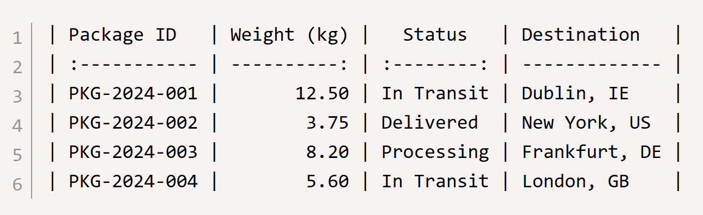
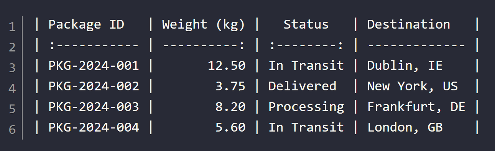

# ⚛️ react-markdown-table-ts 🛡️

[](https://www.npmjs.com/package/react-markdown-table-ts)
[](https://codecov.io/gh/keithwalsh/react-markdown-table-ts)

[](https://codeclimate.com/github/keithwalsh/react-markdown-table-ts)
[](https://github.com/keithwalsh/react-markdown-table-ts/commits/HEAD/)

|  |   |
|------------------------------------------|-----------------------------------------|
| `'light'` theme                          | `'dark'` theme                          |

## Overview 
This library provides a React component for generating and displaying formatted Markdown tables with syntax highlighting. The core component is `MarkdownTable` which converts 2D array data into properly formatted Markdown table syntax.

## API
```typescript
interface MarkdownTableProps {
    inputData?: string[][] | null;
    columnAlignments?: readonly Alignment[];
    isCompact?: boolean;
    hasPadding?: boolean;
    hasTabs?: boolean;
    hasHeader?: boolean;
    convertLineBreaks?: boolean;
    theme?: 'light' | 'dark';
    className?: string;
    preStyle?: React.CSSProperties;
    onGenerate?: (markdownTableString: string) => void;
}
```
| Prop                 | Type                                    | Default     | Description                                                                        |
|----------------------|-----------------------------------------|-------------|------------------------------------------------------------------------------------|
| `inputData`          | `string[][] \| null`                    | `null`      | The outer array represents rows. The inner array represent cells within each row. |
| `columnAlignments`   | `readonly Alignment[]`                  | `[]`	       | Acceptable values are 'left', 'center', 'right', or 'none'.                        |
| `isCompact`          | `boolean`                               | `false`     | Disables column width alignment to provide a more compact markdown table string.   |
| `hasPadding`         | `boolean`                               | `true`      | One space added before and after the content in each cell.                         |
| `hasTabs`            | `boolean`                               | `false`     | Adds a tab character after each \| and before the content.                         |
| `hasHeader`          | `boolean`                               | `true`      | Indicates whether the first row of `data` is a header.                             |
| `convertLineBreaks`  | `boolean`                               | `false`     | Replace newlines with <br> tags in table cells.                                    |
| `theme`              | `'light' \| 'dark'`                     | `light`     | Controls the color scheme of the \<pre\> element display.                            |
| `className`          | `string`                                | `undefined` | Class will be applied to the \<pre\> element display.                                |
| `preStyle`           | `React.CSSProperties`                   | `undefined` | Allows direct styling of the display with CSS properties.                          |
| `onGenerate`         | `(markdownTableString: string) => void` | `undefined` | Callback to receive the generated Markdown table string.                           |
## Usage Patterns

1. **Basic Table Generation**:
```typescript
<MarkdownTable
    inputData={[
        ["Header 1", "Header 2"],
        ["Row 1 Col 1", "Row 1 Col 2"]
    ]}
/>
```
2. **Column Alignment**:
```typescript
<MarkdownTable
    inputData={data}
    columnAlignments={['left', 'center', 'right']}
/>
```
3. **Auto-Generated Headers**:
```typescript
<MarkdownTable
    inputData={data}
    hasHeader={false} // Will generate A, B, C... headers
/>
```

## Behaviors

1. **Input Validation**:
- Input must be non-null 2D string array
- All rows should contain string values
- Empty arrays are not allowed
- Column alignments must be valid ('left', 'center', 'right', 'none')

2. **Column Width Handling**:
- Default: Adjusts columns to fit content
- `isCompact={true}`: Minimizes column widths
- Maintains minimum width of 3 characters for alignment indicators

3. **Error Handling**:
- Returns error message string if validation fails
- Wraps errors in `MarkdownTableError` class
- Preserves stack traces for debugging

4. **Styling**:
- Uses Prism.js for syntax highlighting
- Supports light/dark themes
- Custom styles via `className` and `preStyle` props

## Common Transformations

1. **Data Formatting**:
- Newlines can be converted to `<br>` tags with `canReplaceNewlines`
- Padding can be controlled with `hasPadding`
- Tab spacing available with `hasTabs`

2. **Header Generation**:
- Auto-generates A, B, C... headers when `hasHeader={false}`
- Supports custom headers via first row when `hasHeader={true}`
